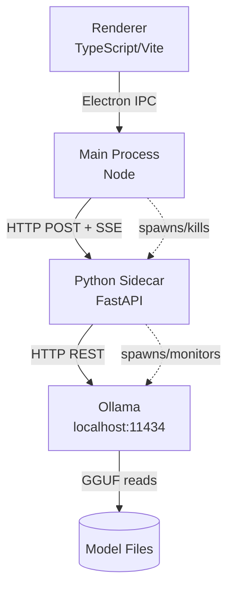
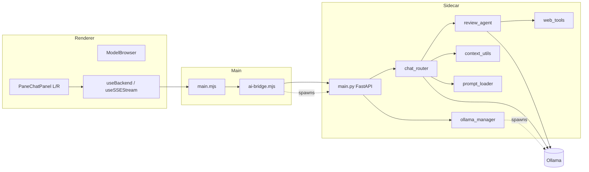

# Architecture Spine — LeapReader AI Research Assistant

## Design Paradigm

**Sidecar-process layered.** The AI assistant is a sidecar process to the Electron host — a separate OS process with its own lifecycle, communicating with the host only via HTTP/SSE on a localhost port negotiated at startup. Within each process, flow is strictly layered and one-directional.

```
Renderer (TypeScript/Vite)
    ↕ Electron IPC
Main Process (Node/Electron)
    ↕ HTTP + SSE (localhost:{port})
Python Sidecar (FastAPI/uvicorn)
    ↕ HTTP REST (localhost:11434)
Ollama Runtime
    ↕ model files
GGUF Models (~/.ollama/models or app userData)
```

Each layer may only call the layer directly below it. No layer may skip or back-call. The renderer never holds the backend port directly — it receives it from Main via IPC.



## Invariants & Rules

### AD-1 — Sidecar process boundary [ADOPTED]

- **Binds:** FR-12, FR-16, all AI endpoints
- **Prevents:** renderer coupling to backend port details; backend coupling to Electron APIs
- **Rule:** The renderer communicates with the backend exclusively through Electron IPC (via Main). Main relays requests to the backend over HTTP and relays SSE streams back to the renderer over IPC. No renderer-to-backend direct HTTP calls. No backend-to-renderer calls.

---

### AD-2 — `pane_id` as universal routing key [ADOPTED]

- **Binds:** FR-1 through FR-5, FR-8, FR-9, FR-16, FR-17, all backend API routes
- **Prevents:** cross-pane context bleed; shared conversation state in split-view
- **Rule:** Every backend API request carries `pane_id: "left" | "right"`. The backend conversation store is keyed `(pane_id, session_id)`. A "Clear" increments only that pane's `session_id`. No request may omit `pane_id`.

---

### AD-3 — SSE-only streaming; five fixed event types [ADOPTED]

- **Binds:** FR-9, FR-11, FR-14, FR-16, FR-17
- **Prevents:** parallel streaming protocols; ambiguous event routing between panes; incompatible source-attribution formats (FR-11); incompatible pull-progress representations (FR-14)
- **Rule:** The backend streams all async data as SSE only — no WebSocket, no polling. All SSE events use this envelope:

```
data: {"type": "token"|"tool_call"|"meta"|"error"|"pull_progress",
       "pane_id": "left"|"right",
       "payload": {...}}
```

`token` — one LLM output token; `payload.text: string`  
`tool_call` — model invoked a tool; `payload.tool: "web_search"|"fetch_url"`, `payload.args` is a **per-tool typed object** (never a generic `object`): `web_search → {query: string}`, `fetch_url → {url: string}`. The Python Pydantic model and the TypeScript `types.ts` discriminated union are both normative for this shape — neither may use different field names.  
`meta` — stream metadata; `payload` may carry: `context_truncated: bool`, `review_offline: bool`, `model_no_tools: bool`, `partial_text: bool`, `sources: [{title: string, url: string}]` (present when web search was used — FR-11 source chips)  
`error` — terminal error; `payload.message: string`, `payload.code: "ABORTED"|"BACKEND_DOWN"|"MODEL_ERROR"|string`  
`pull_progress` — model or Ollama download progress; `payload.model: string`, `payload.percent: number`, `payload.speed_mbps: number`, `payload.eta_s: number`; emitted on dedicated endpoint `GET /pull-progress` (SSE, no pane_id required), relayed via IPC `backend:pull_progress`

Main relays each `ai:stream:{pane_id}` event to the renderer. Pull-progress events are relayed on `backend:pull_progress` (broadcast to all windows).

---

### AD-4 — Process ownership chain and crash-recovery [ADOPTED]

- **Binds:** FR-12, FR-13, NFR-6, electron/ai-bridge.mjs, backend/ollama_manager.py
- **Prevents:** dual spawns, zombie processes, competing lifecycle owners, unrecoverable silent crashes
- **Rule:** Electron Main owns the Python sidecar (spawn on app start, kill on `app.before-quit`). The Python sidecar owns Ollama (detect PATH, download to userData, start, monitor). No other component may spawn or kill either process.
  - **Crash-recovery — sidecar:** On unexpected sidecar exit, Main emits IPC `backend:down` (renders "AI unavailable" state in both panels), then retries spawn up to 3× with 2 s / 5 s / 10 s backoff. After 3 failures, Main emits `backend:failed` and stops retrying; user must restart the app.
  - **Crash-recovery — Ollama:** The sidecar's `ollama_manager` monitors the Ollama process with a watchdog; on unexpected exit, it restarts it once immediately, then once after 5 s. After 2 failures it logs the error and emits an SSE `error` event to any active stream with `code: "OLLAMA_CRASH"`.

---

### AD-5 — Port negotiation via temp file [ADOPTED]

- **Binds:** FR-12, electron/ai-bridge.mjs, backend/main.py
- **Prevents:** hardcoded port conflicts; startup race conditions
- **Rule:** Backend binds to a random free port, writes it to `app.getPath('temp')/leapreader-backend.port` immediately after binding. Main polls this file at 100 ms intervals for up to 10 s. On read, Main emits IPC `backend:ready` carrying the port to all renderer windows. Backend port is never hardcoded anywhere in the codebase.

---

### AD-6 — Context never crosses pane boundary [ADOPTED]

- **Binds:** FR-4, FR-6, FR-8, all prompt construction
- **Prevents:** cross-pane context leakage; wrong document answering questions for the other pane
- **Rule:** Pane Context text is bound to one `pane_id`. The backend prompt builder reads only the context associated with the request's `pane_id`. Backend API endpoints reject requests that attempt to supply context for a different `pane_id` than the routing key.

---

### AD-7 — Extraction strategy is mode-specific and immutable [ADOPTED]

- **Binds:** FR-4, FR-6, FR-7, FR-8, FR-19
- **Prevents:** inconsistent extraction paths; wrong text quality for each mode
- **Rule:**
  - **Chat / Summarize** — `POST /chat` or `POST /summarize` body: `{pane_id, session_id, message: string, context_text: string, web_search: bool}`. The field `context_text` carries the pdfjs-extracted text (≤ 8 000-token cap, trimmed from end). `message` is the user's query or `""` for Summarize.
  - **Review (web or offline)** — `POST /review` body: `{pane_id, session_id, file_path: string, offline: bool}`. The field `file_path` is the absolute path to the PDF on disk. Backend extracts via `pypdf.PdfReader`, joins pages with `--- PAGE BREAK ---`, truncates at 50 000 characters, and sets `meta.partial_text: true` if truncated.
  - These field names are normative for both the FastAPI Pydantic request models and the frontend `useBackend.ts` fetch calls. Neither side may use alternative names (`pdfContent`, `context`, `pdf_path`, etc.).

---

### AD-8 — Tool-call capability detected at review invocation [ADOPTED]

- **Binds:** FR-8, FR-19, backend/review_agent.py
- **Prevents:** silent tool-call failures; corrupt review output on non-tool models
- **Rule:** At the start of each Review (web) invocation, the backend calls `ollama.show(model)` to inspect capabilities. Additionally, on the first tool-bearing `ollama.chat()` call, wrap in `except ollama.ResponseError as e: if "does not support tools" in str(e).lower()` — this is the actual exception raised by `ollama-python` 0.6.2; there is no `ToolNotSupportedError` class. On detection: emit `meta.model_no_tools: true` and downgrade to offline (non-tool) mode. Detection happens per-invocation, not at model-selection time.

---

### AD-9 — Ollama binary stored in userData [ADOPTED]

- **Binds:** FR-13, backend/ollama_manager.py
- **Prevents:** redundant downloads; write-permission failures on system dirs
- **Rule:** Check system PATH for `ollama` first; if found, use it without downloading and set module-level constant `OLLAMA_PROVENANCE = "path"`. If not found, download the OS/arch-appropriate binary from `https://github.com/ollama/ollama/releases/latest` to `app.getPath('userData')/ollama/bin/ollama[.exe]` and set `OLLAMA_PROVENANCE = "bundled"`. Store the resolved binary path in env var `OLLAMA_BIN` visible to the sidecar.
  **Shutdown rule (ties to AD-4):** `ollama_manager.py` kills the Ollama process on sidecar shutdown **only if `OLLAMA_PROVENANCE == "bundled"`**. If `"path"`, Ollama was pre-existing and must be left running. No other module may read or act on `OLLAMA_PROVENANCE`.

---

### AD-10 — pane-origin tagging on #selection-float [ADOPTED]

- **Binds:** FR-18
- **Prevents:** "Ask AI" routing to the wrong pane's chat
- **Rule:** Each pane's `selectionchange` listener sets `data-pane-id="left"` or `data-pane-id="right"` on `#selection-float` before the overlay is shown. The "Ask AI" handler reads `#selection-float.dataset.paneId` to route the action. No other pane-detection mechanism is used for FR-18.

---

### AD-11 — Review streaming: synchronous tool turns, streaming final turn [ADOPTED]

- **Binds:** FR-8, FR-9, backend/review_agent.py
- **Prevents:** blocking the SSE stream during tool calls; out-of-order token delivery
- **Rule:** In the ReAct agent loop, tool-call turns (`ollama.chat(tools=[...])`) are synchronous and blocking — tool results are awaited and injected before the next loop iteration. The final response turn (`ollama.chat(stream=True)`) is streamed and each token emitted as an SSE `token` event. `tool_call` SSE events are emitted synchronously as each tool is invoked (before the final stream starts).

---

### AD-13 — Abort chain protocol [ADOPTED]

- **Binds:** FR-3, FR-16, electron/ai-bridge.mjs, backend/chat_router.py
- **Prevents:** divergent abort implementations where renderer "stops" locally but Ollama keeps generating; or where sidecar cancels but renderer never receives a terminal event
- **Rule:** Abort is a four-layer handshake:
  1. Renderer clicks "Stop" → IPC `ai:abort:{pane_id}` with payload `{session_id: string}` → Main
  2. Main sends `DELETE /chat/{pane_id}/{session_id}` to the sidecar (session_id from IPC payload)
  3. Sidecar cancels the in-flight `asyncio` task for that exact `(pane_id, session_id)` pair and closes the SSE connection
  4. Sidecar emits a final SSE `error` event `{code:"ABORTED", message:"Generation stopped by user"}` before closing
  The renderer treats the `ABORTED` code as a clean stop (not an error state). No component may stop generation without emitting the terminal SSE event.
  **Corollary (one active stream per pane):** The backend enforces at most one active stream per `pane_id`. If a new request arrives while a stream is active for that pane, the backend rejects it with `409 Conflict`. The renderer must abort the current stream before submitting a new one.

---

### AD-12 — Branch isolation [ADOPTED]

- **Binds:** all AI code
- **Prevents:** AI code reaching Android/web builds; untested AI code on main
- **Rule:** All AI-specific files (`src/ai/`, `backend/`, `electron/ai-bridge.mjs`, `extraResources` config for Python/Ollama, `assets/review-prompt.md`) exist only on the `feature/ai-assistant` branch. The `main` branch `package.json` `extraResources` array does not reference any AI assets. Branch merge is the gate; no AI code may be committed directly to `main`.

---

## Consistency Conventions

| Concern | Convention |
| --- | --- |
| Naming — backend modules | `snake_case.py`; one module per bounded concern (ollama_manager, chat_router, review_agent, web_tools, context_utils, prompt_loader) |
| Naming — frontend AI components | `PaneId = "left" \| "right"` — canonical TS type; no string literals elsewhere |
| Naming — IPC channels | `backend:ready`, `backend:down`, `backend:failed`, `backend:pull_progress`, `ai:stream:left`, `ai:stream:right`, `ai:abort:left`, `ai:abort:right` — colon-separated namespace:action[:pane] |
| Naming — SSE event types | `token`, `tool_call`, `meta`, `error` — lowercase; no aliases |
| Data — pane_id | `"left"` or `"right"` string literals only; no numeric indices |
| Data — session_id | UUID v4 generated client-side on each Clear; sent with every request |
| Data — error shapes | Backend errors: `{"error": {"code": string, "message": string}}`; SSE errors: `{type:"error", payload:{code, message}}` |
| State mutation | Conversation history is append-only on the backend. Client-side Clear sends a new `session_id`; it does not call a delete endpoint |
| Config | Backend reads port from `LEAPREADER_PORT` env var (set by Main at spawn). Model tag, Ollama host, and userData path from env vars only — no hardcoded values |
| Logging | Backend logs to stderr only (captured by Electron Main, not forwarded to renderer). Renderer logs via `console.error` only for error conditions |

## Stack

| Name | Version |
| --- | --- |
| Electron | ^34 (existing — see Stack note above) |
| TypeScript | ~5.6 (existing) |
| Vite | ^6 (existing) |
| electron-builder | ^25 (existing) |
| pdfjs-dist | ^4.10 (existing) |
| Python | 3.12 (bundled in uv venv) |
| FastAPI | 0.139.0 |
| uvicorn | 0.50.2 |
| Electron | ^34 (existing — 9 majors behind current v43; tracked risk: outside support window, no security patches; `child_process`/`app` APIs unchanged through v43, no AI breakage) |
| ollama (Python client) | 0.6.2 |
| pypdf | ≥4.0 |
| ddgs (formerly duckduckgo-search) | 9.14.4 — **use `ddgs`, not `duckduckgo-search`** (deprecated/renamed) |
| requests | latest stable (pin to ≥2.32 in pyproject.toml) |
| uv | latest (build-time only; creates venv) |
| Ollama runtime | ≥0.3, latest preferred |

## Structural Seed

```text
leap-reader/
  src/
    reader/           # existing — pane, toolbar, flyouts, selection-float
    ai/               # NEW — AI frontend
      pane-chat-panel/  # PaneChatPanel component (per pane_id)
      model-browser/    # ModelBrowser dialog
      hooks/            # useBackend.ts, useSSEStream.ts
      types.ts          # PaneId, SSEEvent, ChatMessage, ModelInfo
  electron/
    main.mjs          # existing — gains: spawn ai-bridge, relay SSE via IPC
    ai-bridge.mjs     # NEW — Python sidecar spawn, port negotiation, health
  backend/
    main.py           # FastAPI app, /health, CORS localhost-only
    chat_router.py    # POST /chat, /summarize, /review, /abort
    review_agent.py   # ReAct loop; ollama.chat(tools), stream=True final turn
    web_tools.py      # web_search(), fetch_url()
    ollama_manager.py # PATH detect, binary download, process start/monitor
    context_utils.py  # pypdf extraction, token counting, trim logic
    prompt_loader.py  # loads assets/review-prompt.md from extraResources
    pyproject.toml    # uv project; pins all deps
  assets/
    review-prompt.md  # bundled ai-dm-paper-review system prompt (asset)
```



## Capability → Architecture Map

| Capability / FR | Lives in | Governed by |
| --- | --- | --- |
| Per-pane toggle, chat thread, input (FR-1–3) | `src/ai/pane-chat-panel/` | AD-2 (pane_id), AD-3 (SSE events) |
| Pane-bound context injection (FR-4) | `chat_router.py` + `context_utils.py` | AD-6 (no cross-pane), AD-7 (extraction split) |
| Clear chat session (FR-5) | Renderer + `chat_router.py` | AD-2 (session_id reset) |
| Summarize shortcut (FR-6–7) | `chat_router.py` | AD-7 (pdfjs text in body) |
| Review ReAct agent (FR-8) | `review_agent.py` | AD-7 (pypdf), AD-8 (tool detect), AD-11 (streaming) |
| Review offline mode (FR-19) | `review_agent.py` | AD-8 (no tools path) |
| Review output / tool status display (FR-9) | `pane-chat-panel/` + `useSSEStream.ts` | AD-3 (token/tool_call events) |
| Web search toggle (FR-10–11) | `chat_router.py` + `web_tools.py` | AD-6 (pane_id), AD-3 (meta event) |
| Backend lifecycle (FR-12) | `electron/ai-bridge.mjs` | AD-4 (ownership), AD-5 (port negotiation) |
| Ollama install + start (FR-13) | `backend/ollama_manager.py` | AD-4, AD-9 (userData path) |
| Default model pull (FR-14) | `backend/ollama_manager.py` | AD-4 |
| Model Browser (FR-15) | `src/ai/model-browser/` + `chat_router.py` | AD-2 (pane_id), Conventions (session clear on switch) |
| Streaming delivery (FR-16–17) | `chat_router.py` → SSE → `ai-bridge.mjs` → IPC → renderer | AD-1, AD-3, AD-11 |
| Ask AI on selection (FR-18) | `src/reader/` + `src/ai/` | AD-10 (pane-origin tagging) |

## Deferred

- **Context window size** (OQ-4 from PRD): end-trim vs. middle-cut for chat/summarize — deferred to `context_utils.py` implementation sprint; spine does not bind the trim strategy, only the limit (8 000 tokens chat, 50 000 chars review).
- **DuckDuckGo rate-limit handling** (OQ-1 note): retry / backoff strategy for scrape-rate-limit errors — deferred to `web_tools.py` implementation sprint.
- **Ollama version pinning** (OQ-3 from PRD): pin specific Ollama release tag vs. always-latest — deferred to `ollama_manager.py` implementation; spine binds only the minimum version (0.3+).
- **Model pull progress granularity**: pull-progress event frequency and UI debounce — deferred to `pane-chat-panel/` implementation.
- **Session persistence** (PRD §6.2): conversation history across restarts — deferred to v2; no spine change required, only `chat_router.py` storage backend.
- **SearXNG backend** (PRD §6.2): swap of DuckDuckGo — deferred to v2; `web_tools.py` is the only touch point, convention-isolated.
- **Cross-pane context** (PRD §6.2): simultaneous two-document prompting — deferred to v2; requires a new AD (shared context pool or cross-pane IPC), not yet designed.
- **Operational envelope / deployment**: no packaging CI, no auto-update pipeline, no code-signing workflow defined here — deferred to release engineering; out of scope for feature altitude.
